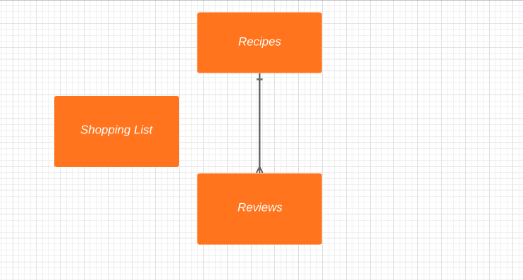
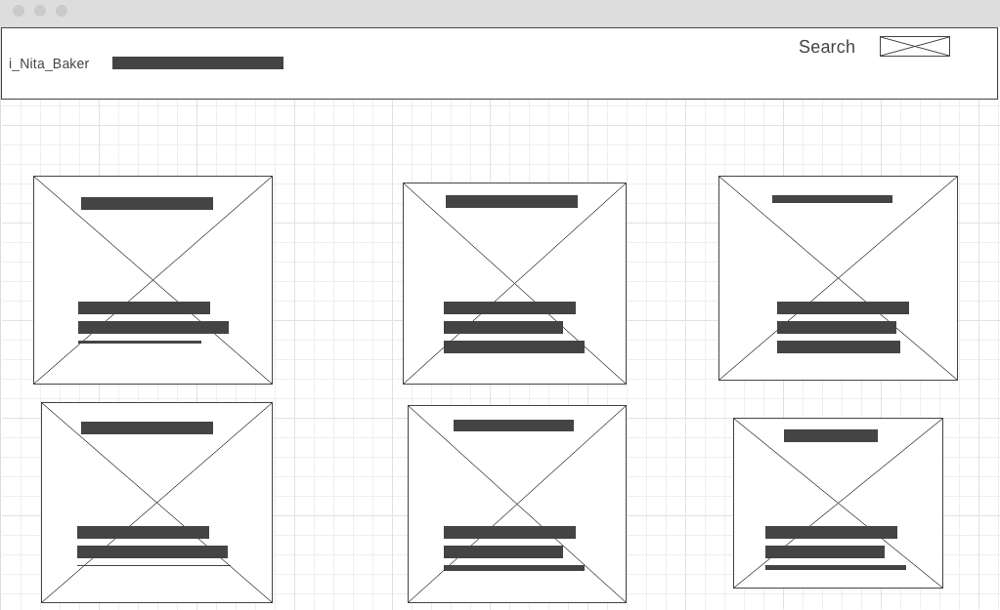
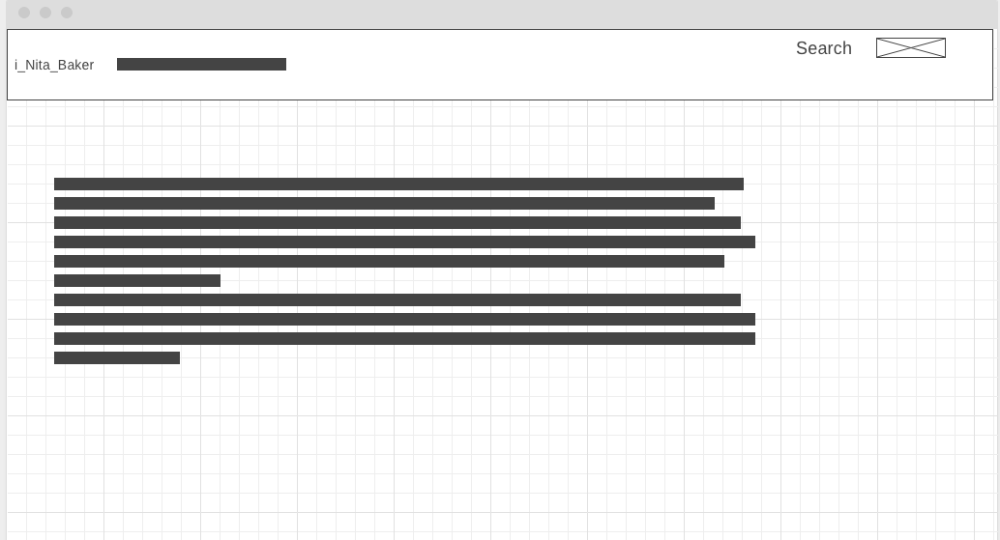
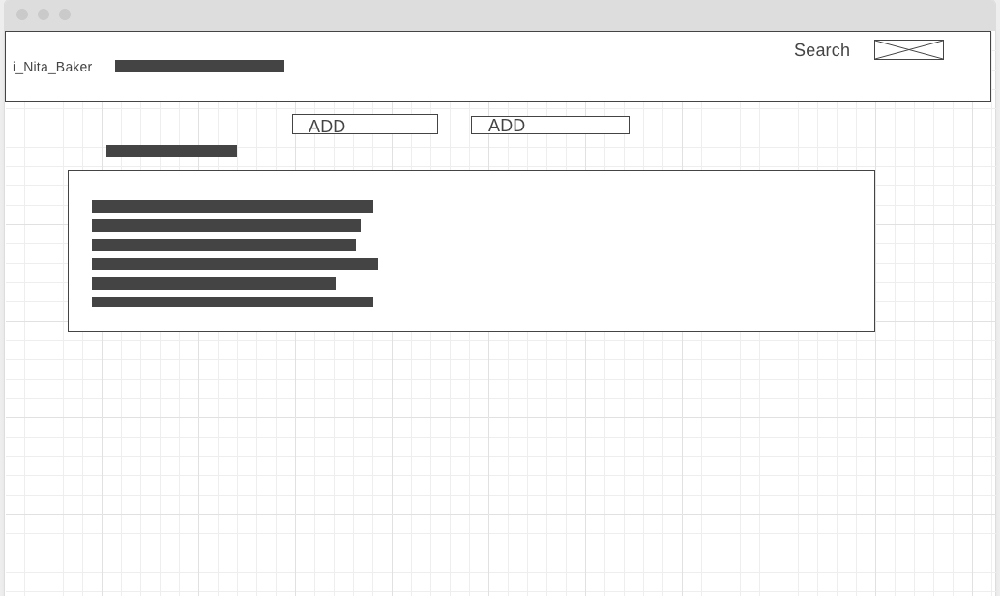

# i_Nita_Baker
 

## Overview
Coming out of college i told myself i would make something other than chow mein, bbq chicken and white rice. Well when i moved to south Fl after scool i got spolied moving closer to family so i could get cooking and o got even more soiled when i met my wife because she the best cook ever. I wanted to finally fulfill my promise to myself as well as give my wife ideas for her arsenal.

for project 4, I created fullstack app that a user can create recipes as well as add ingredients and instructions on how to make it. The user can even have a shopping list to track what ingredients they need. 

My future improvent is this app is to add a 3rd party Api to search for recipes froma 3rd party. Also be able to cross off the items in shopping list and add the total up.
 

## Technologies Used
* HTML, CSS, Javascript
* Django
* Python
* MongoDB & Mongoose
* express
* Project Planning & User Stories - [Trello](https://trello.com/b/9mXiZtsk/better-barber-bureau).

## Online Resources
* YouTube
* Google
* Stackoverflow
* VS Code
* Slack

## Wireframe / ERD

## [i_Nita_Baker](http://localhost:3000/)
